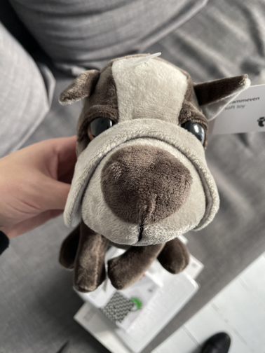
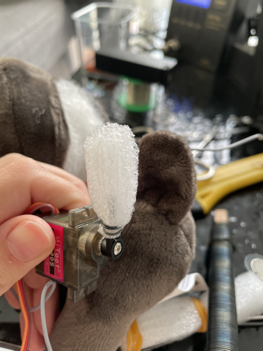
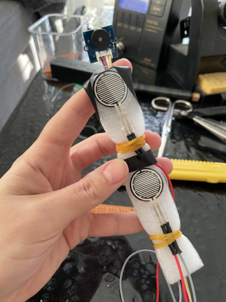
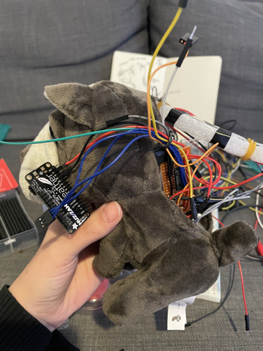

# arduino-robot-dog

A robot dog created from a simple plush toy. 

## Components

### Materials

* Plush dog toy (https://shop.dk.flyingtiger.com/products/krammeven-hund-170192301?variant=31504011952181)
* Foam - in order to better distribute the pressure over the FSRs

### Hardware

* Adafruit Feather Huzzah ESP8266 (https://www.adafruit.com/product/2821)
* Micro Servo MG90S (https://www.adafruit.com/product/169)
* Grove Buzzer (Piezo speaker) (https://wiki.seeedstudio.com/Grove-Buzzer/)
* Sound Detector (https://www.aliexpress.com/item/32569653599.html)
* 4 x FSR (Force Sensitive Resistor) (https://www.adafruit.com/product/166) + 4 x 12k ohm resistors and 4 x 22k ohm resistors
* IC 4051 (8-channel Analog Multiplexer/Demultiplexer) (https://playground.arduino.cc/Learning/4051/, datasheet: https://www.ti.com/lit/ds/symlink/cd4051b.pdf)
* Wires

### Software

* Arduino IDE, where you need to install the required libraries for Adafruit Feather Huzzah ESP8266 (https://learn.adafruit.com/adafruit-feather-huzzah-esp8266/using-arduino-ide)

### Other projects

* Adafruit Trinket-Modded Stuffed Animal (https://learn.adafruit.com/adafruit-trinket-modded-stuffed-animal?view=all) - inspiration for the different sounds that can be made

## Circuit

## Build process

This is a standard cute plush toy, ready to be enhanced with sensors and actuators:

 

A reasonable amount of the fluffy stuffing needs to be taken out in order to make space for the electronics:

The servo horn is enclosed in some soft foam and then fit into the tail:

 

The FSRs are added on a long strip of foam, at the end of which there's the buzzer / sound sensor:

  

Fit the FSRs foam strips inside the toy:

  

All components assembed but before covering everything, might want to do some programming/enhancements. 

This is a **work-in-progress** project :)

## Current functionality

The dog wags its tail. 

* The current code only moves the servo, however there are functions that you can call to do other stuff as well. 
* Note: remember to also ensure things are connected correctly in the dog itself as well. As you enable more functionality, refer to the schematics above on how the components are to be connected. 

## Ideas for basic functionality

* When the dog is being petted, the tail will move and it will bark. The dog is happy. 
* When there's complete silence for a duration of time, the dog will start making high-pitch sounds requesting attention. The dog is sad.

## Ideas for further development

Customize your dog!

* There are 4 force sensors in the dog, and you can read the value of each of them individually. Currently, the actions for when the dog is being petted (i.e. there is some force applied on the sensors) is the same. An idea for further development is to apply customized actions depending on *where* the dog is being petted. 
* Customize the sounds that the dog makes.
* Add additional sensors, for examples a gas sensor, a temperature sensor or a distance sensor. 
* Replace the micro-USB power supply with a Lithium polymer battery (see the documentation for the Adafruit Feather Huzzah board) which will make the dog a bit less heavy. 
* The Adafruit Feather Huzzah board has Wi-Fi on board! So you could control remotely your dog, as well as log the data from its sensors. For example, you could make the dog bark whenever you want (or when the others the least expect it), or you can track how much it has been petted over time. You can have a look at the Adafruit.io platform if you need inspiration for how to store sensor data. 
* The sound sensor in the dog has both an analog and digital output. That means that if using the analog input you would get more information about the sound around. It first needs to be soldered into the board (note that the IC 4051 has possibility for 8 input channels but only 4 are used at the moment). One potential application is to make the tail move in rythm with music. 
* Add more servos to make other parts of the dog move. 
